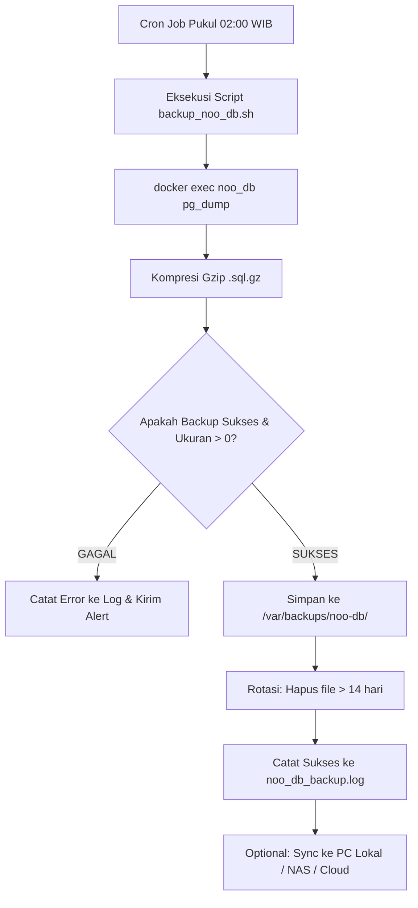

# 🛡️ SOP & Alur Implementasi Best Practice: Backup Database Harian Otomatis (NOO Server)

Dokumen ini memuat standar operasional implementasi backup database PostgreSQL harian otomatis untuk server produksi **NOO Server (`172.22.1.232`)**.

---

## 📊 1. Diagram Alur Sistem Backup



---

## 📋 2. Tahapan Implementasi (Step-by-Step)

### **Fase 1: Persiapan Direktori & Hak Akses di Server**

Login ke server Ubuntu via SSH:
```bash
ssh adminit@172.22.1.232
```

Buat direktori penyimpanan backup dan log:
```bash
sudo mkdir -p /var/backups/noo-db
sudo mkdir -p /var/log/backup-scripts

# Berikan hak kepemilikan ke user adminit
sudo chown -R adminit:adminit /var/backups/noo-db
sudo chown -R adminit:adminit /var/log/backup-scripts
```

---

### **Fase 2: Pembuatan Script Backup Produksi**

Buat file script di `/home/adminit/scripts/backup_noo_db.sh`:
```bash
mkdir -p /home/adminit/scripts
nano /home/adminit/scripts/backup_noo_db.sh
```

Tempelkan kode script berikut (*production-ready*):

```bash
#!/bin/bash
# ==============================================================================
# SCRIPT BACKUP HARIAN POSTGRESQL DOCKER (NOO-SERVER)
# ==============================================================================

set -eo pipefail

# Konfigurasi
BACKUP_DIR="/var/backups/noo-db"
LOG_FILE="/var/log/backup-scripts/noo_db_backup.log"
CONTAINER_NAME="noo_db"
DB_NAME="noo_v2_db"
DB_USER="postgres"
RETENTION_DAYS=14
TIMESTAMP=$(date +'%Y-%m-%d_%H%M%S')
BACKUP_FILE="${BACKUP_DIR}/db_${DB_NAME}_${TIMESTAMP}.sql.gz"

# Fungsi Logging
log() {
    echo "[$(date +'%Y-%m-%d %H:%M:%S')] $1" | tee -a "$LOG_FILE"
}

log "========================================================"
log "🚀 Memulai proses backup database: $DB_NAME"

# 1. Validasi Status Container Docker
if ! docker ps --format '{{.Names}}' | grep -w "$CONTAINER_NAME" > /dev/null; then
    log "❌ FATAL: Container $CONTAINER_NAME tidak berjalan!"
    exit 1
fi

# 2. Eksekusi pg_dump & kompresi stream gzip
log "📦 Melakukan dump database dan kompresi gzip..."
if docker exec -t "$CONTAINER_NAME" pg_dump -U "$DB_USER" "$DB_NAME" | gzip > "$BACKUP_FILE"; then
    FILE_SIZE=$(du -h "$BACKUP_FILE" | cut -f1)
    
    # Validasi bahwa file tidak kosong (minimal > 10KB)
    ACTUAL_BYTES=$(stat -c%s "$BACKUP_FILE" 2>/dev/null || stat -f%z "$BACKUP_FILE")
    if [ "$ACTUAL_BYTES" -gt 10240 ]; then
        log "✅ Backup BERHASIL: $BACKUP_FILE (Ukuran: $FILE_SIZE)"
    else
        log "⚠️ WARNING: File backup terlalu kecil ($ACTUAL_BYTES bytes). Periksa integritas database!"
        exit 1
    fi
else
    log "❌ FATAL: Terjadi error saat eksekusi pg_dump!"
    rm -f "$BACKUP_FILE"
    exit 1
fi

# 3. Rotasi Backup (Hapus data yang berumur lebih dari 14 hari)
log "🧹 Menjalankan pembersihan backup yang berusia > $RETENTION_DAYS hari..."
DELETED_COUNT=$(find "$BACKUP_DIR" -type f -name "db_${DB_NAME}_*.sql.gz" -mtime +$RETENTION_DAYS | wc -l)
find "$BACKUP_DIR" -type f -name "db_${DB_NAME}_*.sql.gz" -mtime +$RETENTION_DAYS -delete
log "🗑️ Selesai membersihkan ($DELETED_COUNT file lama dihapus)."

log "🏁 Proses backup selesai dengan sukses."
```

Beri hak izin eksekusi script:
```bash
chmod +x /home/adminit/scripts/backup_noo_db.sh
```

---

### **Fase 3: Uji Coba Manual (Smoke Test)**

Jalankan script pertama kali untuk memastikan tidak ada error syntax atau permission:
```bash
/home/adminit/scripts/backup_noo_db.sh
```

Periksa hasil output file dan log:
```bash
ls -lh /var/backups/noo-db/
tail -n 20 /var/log/backup-scripts/noo_db_backup.log
```

---

### **Fase 4: Penjadwalan Otomatis (Cron Job)**

Buka editor cron untuk user `adminit`:
```bash
crontab -e
```

Tambahkan baris berikut di baris paling bawah:
```cron
# Backup Database NOO Server setiap hari pukul 02:00 WIB
0 2 * * * /home/adminit/scripts/backup_noo_db.sh > /dev/null 2>&1
```

*(Opsional)* Konfigurasikan logrotate agar file log `/var/log/backup-scripts/noo_db_backup.log` tidak membesar tanpa batas:
```bash
sudo nano /etc/logrotate.d/noo-backup
```
Isi dengan:
```text
/var/log/backup-scripts/*.log {
    monthly
    rotate 6
    compress
    missingok
    notifempty
}
```

---

### **Fase 5: Sinkronisasi Offsite ke Komputer Lokal / NAS (Aturan 3-2-1)**

Untuk mengantisipasi kerusakan fisik server atau harddisk server down, backup sebaiknya ditarik berkala ke komputer lokal/kantor.

#### **Skrip Otomatis di Windows (PowerShell):**
Simpan script ini di PC lokal Anda, misalnya `D:\Scripts\pull_backup_live.ps1`:

```powershell
$SERVER = "adminit@172.22.1.232"
$REMOTE_DIR = "/var/backups/noo-db"
$LOCAL_DIR = "D:\DatabaseBackups\noo-server"

New-Item -ItemType Directory -Force -Path $LOCAL_DIR | Out-Null

Write-Host "Mengambil daftar backup terbaru dari server..."
$LATEST_FILE = (ssh $SERVER "ls -t $REMOTE_DIR/db_noo_v2_db_*.sql.gz 2>/dev/null | head -n 1").Trim()

if ($LATEST_FILE) {
    Write-Host "Mendownload $LATEST_FILE ..."
    scp "$SERVER`:$LATEST_FILE" "$LOCAL_DIR\"
    Write-Host "✅ Download selesai ke $LOCAL_DIR"
} else {
    Write-Host "❌ Tidak ada file backup ditemukan di remote server."
}
```

Script PowerShell di atas dapat dijadwalkan otomatis melalui **Windows Task Scheduler** (misal jalan tiap jam 07:00 pagi saat jam kantor mulai).

---

## 🔄 3. SOP Disaster Recovery (Prosedur Pemulihan / Restore)

Jika terjadi kendala data korup atau server perlu di-restore ulang:

### **Langkah Restore di Server Live:**
```bash
# 1. Pilih file backup yang ingin direstore
cd /var/backups/noo-db
gunzip -k db_noo_v2_db_YYYY-MM-DD_HHMMSS.sql.gz

# 2. Restore ke PostgreSQL Container
docker exec -i noo_db psql -U postgres -d noo_v2_db < db_noo_v2_db_YYYY-MM-DD_HHMMSS.sql

# 3. Jalankan pembersihan cache Laravel
cd /var/www/noo-server
docker compose exec app php artisan optimize:clear
```

### **Langkah Restore di PC Pengembang (Lokal):**
```powershell
# Di PowerShell lokal:
tar -xvzf db_noo_v2_db_YYYY-MM-DD_HHMMSS.sql.gz
docker exec -i noo_db psql -U postgres -d noo_v2_db < db_noo_v2_db_YYYY-MM-DD_HHMMSS.sql
php artisan optimize:clear
```

---

## 🎯 Ringkasan Keunggulan Skema Ini:
1. **Zero Downtime**: `pg_dump` berjalan tanpa mematikan website / database.
2. **Hemat Storage**: Kompresi gzip menghemat penyimpanan hingga 80%.
3. **Self-Cleaning**: Otomatis menghapus file berumur > 14 hari.
4. **Audit Trail & Observabilitas**: Setiap tahapan dicatat ke log file `/var/log/backup-scripts/noo_db_backup.log`.
5. **Aman dari Bencana**: Salinan offsite ke PC lokal memastikan data selalu bisa dipulihkan.
