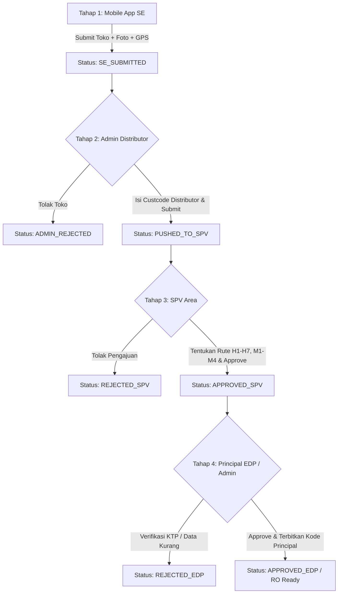

# 📘 Dokumentasi Komprehensif Arsitektur & Alur Sistem Informasi NOO+ (New Open Outlet)

Dokumen ini merupakan referensi resmi (*living memory*) mengenai arsitektur, desain sistem, alur operasional *end-to-end*, konfigurasi teknis, struktur basis data, dan tata kelola hak akses **Sistem Informasi NOO+ (ASWFOODS & INAFOODS)**.

---

## 1. Fundamental & Tujuan Sistem

**Sistem Informasi NOO+** adalah platform terintegrasi untuk mendigitalkan, menstandarisasi, dan mengotomasi proses pendaftaran outlet/toko baru (*New Open Outlet*) secara nasional untuk principal **ASWFOODS** dan **INAFOODS**. 

Sistem ini menggantikan seluruh proses lama (*legacy Google Apps Script & Google Spreadsheet*) menjadi sistem enterprise berbasis database terpusat yang tangguh, aman, dan dapat diaudit secara *real-time*.

### Tujuan Utama:
1. **Validitas & Akurasi Data Toko**: Menghilangkan duplikasi toko, memverifikasi foto fisik toko & KTP pemilik, serta memastikan akurasi titik koordinat GPS di lapangan dengan mekanisme *GPS Locking & Geo-Sampling*.
2. **Efisiensi Rantai Otorisasi (4 Tahap Workflow)**: Menghubungkan Sales Executive (lapangan), Admin Distributor (cabang), Supervisor Area (SPV), dan Tim Principal (EDP/Admin/Superadmin).
3. **Penerbitan Kode Pelanggan Principal Unik**: Otomasi generator nomor urut *Customer Code Principal* (`code_noo_principal`) berbasis prefix entitas, region, dan counter sequence terkontrol.
4. **Integrasi & Pemantauan Target RO**: Pelacakan target dan realisasi *Registered Outlet (RO)* per salesman dan cabang secara transparan.

---

## 2. Arsitektur & Teknologi (Tech Stack)

```
[ Android App (SE) ] ──(REST API)──┐
                                   ▼
[ Web Browser (Distributor/SPV) ] ──┼──► [ Nginx / Reverse Proxy ]
                                   │              │
[ Web Browser (Principal Portal) ] ─┘              ▼
                                          [ Laravel 12 Backend ]
                                          ├── Inertia.js + Vue 3 (SSR/SPA)
                                          ├── Eloquent & Query Builder
                                          ├── PhpSpreadsheet (Export Engine)
                                          └── Storage Driver (Local/Public)
                                                  │
                                                  ▼
                                      [ PostgreSQL 16 Database ]
```

### Komponen Teknologi:
- **Backend Framework**: PHP 8.2+ / Laravel 12.x
- **Frontend Architecture**: Vue.js 3 (Composition API / `<script setup>`), Inertia.js, Tailwind CSS
- **Database Engine**: PostgreSQL 16 (dengan indeks performa khusus pada pencarian teks dan filter status)
- **Containerization**: Docker & Docker Compose (`docker compose exec app ...`)
- **Web Server / Gateway**: Nginx Reverse Proxy
- **File Storage**: Local Symbolic Storage (`storage/app/public/noo_photos/` disajikan via `/storage/`)
- **Excel & Document Engine**: `PhpSpreadsheet` (dengan optimasi memori untuk dataset skala besar)

---

## 3. Analisis Alur Operasional End-to-End (4 Tahapan Workflow)



### Tahap 1: Sales Executive (Mobile App Android NOO+ v2.0)
- **Aktor**: Salesman / Sales Executive (SE) di lapangan.
- **Aktivitas**:
  1. Login ke aplikasi Android NOO+ dengan memilih Cabang & Salesman serta verifikasi PIN Cabang.
  2. Mengisi metadata toko: Nama Toko, Nama Pemilik, No. HP, Alamat, Kelurahan, Kecamatan, Kab/Kota, Provinsi, dan Tipe Outlet.
  3. Mengambil titik koordinat GPS (*GPS Locking & Multi-Sampling* dengan batas toleransi akurasi meter).
  4. Mengambil 2 foto fisik toko: **Tampak Depan** (dengan plang/toko) dan **Tampak Dalam** (rak/display).
  5. Mengirim data ke endpoint backend `POST /api/mobile/submit-meta` dan `POST /api/mobile/upload-photo`.
- **Status Awal**: `SE_SUBMITTED`.

### Tahap 2: Portal Admin Distributor (`/distributor-login` -> `/distributor/inbox`)
- **Aktor**: Admin Distributor di kantor cabang.
- **Aktivitas**:
  1. Login bertingkat (*Cascading Form*): Memilih Principal Area -> Region -> Entity -> Branch -> Masukkan PIN Cabang.
  2. Memeriksa inbox pengajuan toko baru dari salesman cabangnya.
  3. Memvalidasi data, menginput **Kode Customer Distributor** (`custcode_distributor`) yang terdaftar pada sistem internal cabang.
  4. Menambahkan catatan admin (`admin_notes`).
  5. **Tindakan**:
     - **Push to SPV**: Mengirimkan pengajuan ke Supervisor Area (`PUSHED_TO_SPV`).
     - **Tolak Pengajuan**: Menolak pengajuan dengan mencantumkan alasan penolakan (`ADMIN_REJECTED`).

### Tahap 3: Portal SPV Area (`/spv-login` -> `/spv/inbox`)
- **Aktor**: Supervisor Area (SPV) binaan cabang terkait.
- **Aktivitas**:
  1. Login menggunakan Salescode SPV & Password.
  2. Melihat daftar pengajuan yang telah dipush oleh Admin Distributor pada cabang binaannya (`myBranches`).
  3. Melakukan verifikasi kelayakan toko, keabsahan lokasi, dan potensi penjualan.
  4. **Penyusunan Rute Kunjungan (JKS)**: Menetapkan hari kunjungan (`H1` s/d `H7`) dan pola minggu kunjungan (`M1`, `M2`, `M3`, `M4`).
  5. **Tindakan**:
     - **Approve SPV**: Menyetujui pengajuan toko beserta rutenya untuk diteruskan ke Principal (`APPROVED_SPV`).
     - **Reject SPV**: Menolak pengajuan dengan mencantumkan alasan pembatalan (`REJECTED_SPV`).

### Tahap 4: Portal Principal (`/principal/inbox`, `/principal/dashboard`, dll.)
- **Aktor**: EDP Regional, Admin Principal, dan Superadmin.
- **Aktivitas**:
  1. **NOO Verification**:
     - Verifikasi kelengkapan dokumen toko, foto tampak depan, foto tampak dalam, dan foto KTP.
     - **Watermarking & Revisi KTP**: Memverifikasi KTP pemilik atau memberikan izin revisi KTP 1x dengan watermark pengaman otomatis.
     - **Penerbitan Kode Principal**: Mengenerate nomor urut `code_noo_principal` unik berdasarkan prefix entitas dan sequence database.
     - **Keputusan**: `APPROVED_EDP` (toko resmi terdaftar dan siap di-inject ke ERP Eskalink) atau `REJECTED_EDP` (dikembalikan/ditolak).
     - **RO (Registered Outlet) Toggling**: Mengubah status keikutsertaan toko dalam program target RO.
     - **Ekspor Data**: Mengunduh berkas laporan Excel (.xlsx) data Approved & Rejected lengkap.
  2. **Monitoring RO (`/principal/monitoring-ro`)**:
     - Memantau pencapaian realisasi toko baru RO terhadap target bulanan per salesman/cabang.
     - Mengunggah berkas template target RO bulanan (.xlsx).
  3. **Progress Tracking NOO (`/principal/progress-tracking`)**:
     - Melacak jejak audit status submisi secara transparan.
     - Fitur Reset Otoritas: Superadmin / Admin dapat melakukan *Reset Inputan Admin Distributor* (kembali ke `SE_SUBMITTED`) atau *Reset Keputusan SPV* (kembali ke `PUSHED_TO_SPV`).
  4. **NOO Master Data (`/principal/master-*`)**:
     - Pengelolaan data Master Region, Master Entity, Master Branch, Master Salesman, Master SPV, Master Outlet Types, dan Counter Sequence.
  5. **Manajemen Akun & Role Manager (`/principal/account-management`)**:
     - Manajemen akun pengguna portal dan pengaturan **Matriks Hak Akses Peran Pengguna (Permissions Matrix)** dengan pemisahan akses *View Only* dan *Kelola/Edit*.
  6. **Logs & Audit (`/principal/logs`)**:
     - Rekaman riwayat aktivitas operasional seluruh pengguna sistem (*Audit Trail*).

---

## 4. Struktur Basis Data & Tabel-Tabel Utama

### 1. `noo_submissions` (Tabel Inti Submisi Toko)
Menyimpan seluruh siklus hidup pengajuan toko dari mobile hingga principal.
- **Identifikasi**: `id` (BigSerial, PK), `request_id` (UUID string, Unique, Idempotency key).
- **Metadata Toko**: `nama_noo`, `nama_pemilik_outlet`, `no_hp_noo`, `alamat_noo`, `kel_noo`, `kec_noo`, `kab_kota_noo`, `provinsi_noo`, `type_outlet_code`, `type_outlet_desc`.
- **Organisasi & Principal**: `principal` ('ASWFOODS'/'INAFOODS'), `principal_code`, `sub_group_region`, `region_code`, `branch_id`, `branch_name`, `area_code`, `salesman_code`, `salesman_name`.
- **Geolokasi & GPS**: `la`, `lg`, `accuracy_m`, `samples_count`, `locked_la`, `locked_lg`, `locked_accuracy_m`, `mock_flag_locked`, `submit_la`, `submit_lg`, `submit_accuracy_m`, `mock_flag_submit`, `submit_distance_m`, `submit_radius_m`.
- **Berkas Foto**: `photo_depan_url`, `photo_dalam_url`, `photo_ktp_url`, `ktp_owner_name`, `photo_status`.
- **Mapping Kode Pelanggan**: `custcode_distributor`, `code_noo_principal`, `previous_code_noo_principal`.
- **Rute Kunjungan SPV (JKS)**: `call_plan_frequency`, `call_plan_week`, `call_plan_days` (JSON/Array), `spv_salescode`, `spv_name`.
- **Status & Siklus Hidup**: `status` (Enum/Varchar), `is_ro` (Boolean), `submitted_at`, `pushed_to_spv_at`, `approved_spv_at`, `approved_edp_at`, `rejected_at`, `reject_reason`, `reset_reason`.
- **Catatan & Approver**: `admin_notes`, `spv_notes`, `edp_notes`, `admin_approver_name`, `spv_approver_name`, `edp_approver_name`.

### 2. `users` (Tabel Akun Pengguna Portal Principal)
- `id`, `username`, `name`, `email`, `password`.
- `role`: `'SUPERADMIN'`, `'ADMIN_PRINCIPAL'`, `'EDP_REGION'`.
- `region_code`: Scoping wilayah akses data (contoh: `'ASWSUM'`, `'INAJWA'`, atau multiple dipisah koma).
- `entity_code_principal`: Scoping entitas spesifik jika ada.
- `is_active`: Status aktif akun.

### 3. `master_regions` & `master_entities` (Hierarki Wilayah & Entitas Principal)
- **`master_regions`**: `id`, `region_code` (Unique), `region_name`, `principal_code` ('ASW'/'INA'), `principal_name` ('ASWFOODS'/'INAFOODS'), `is_active`.
- **`master_entities`**: `id`, `region_code`, `region_name`, `entity_code_principal` (Unique), `entity_name_principal`, `principal_code`, `principal_name`, `is_active`.

### 4. `master_branches`, `master_salesmen`, `master_spvs`, `master_outlet_types`
- **`master_branches`**: `id`, `branch_id` (Unique), `branch_name`, `region_code`, `region_name`, `entity_code_principal`, `entity_name_principal`, `pin_branch`, `is_active`.
- **`master_salesmen`**: `id`, `salesman_code` (Unique), `salesman_name`, `branch_id`, `branch_name`, `is_active`.
- **`master_spvs`**: `id`, `salescode` (Unique), `spv_name`, `password`, `branch_ids` (Array string cabang binaan), `is_active`.
- **`master_outlet_types`**: `id`, `code` (Unique), `description`, `is_active`.

### 5. `counter_sequences` (Generator Nomor Urut Kode Customer Principal)
- Menyimpan nilai atomik penomoran berjalan berdasarkan prefix kode cabang/entitas: `id`, `prefix_code`, `current_number`, `updated_at`.

### 6. `target_ros` (Target RO Bulanan Salesman)
- Menyimpan target toko baru berstatus Registered Outlet (RO): `id`, `branch_id`, `salesman_code`, `target_month` (YYYY-MM), `target_ro_count`.

### 7. `activity_logs` (Audit Trails)
- Rekaman setiap aksi operasional pengguna: `id`, `username`, `user_role`, `action` ('CREATE', 'UPDATE', 'DELETE', 'APPROVE', 'REJECT', 'RESET'), `module`, `description`, `ip_address`, `created_at`.

---

## 5. Tata Kelola Hak Akses & Matriks Otorisasi (Permissions Matrix)

Matriks hak akses portal dikelola secara sentral oleh **Superadmin** melalui menu `Manajemen Akun` (`AccountManagement.vue`). Seluruh modul Master Data dan fitur operasional dipisahkan menjadi dua tingkatan hak akses:
1. **Lihat / View Only**: Mengizinkan pengguna membuka halaman, melihat data tabel, dan menggunakan filter pencarian tanpa izin mengubah data.
2. **Kelola / Tambah / Edit / Hapus**: Mengizinkan pembuatan data baru, pengeditan data, dan penghapusan data master.

### Standar Otorisasi Bawaan (Default Matrix):
| Modul / Fitur Portal | EDP Region | Admin Principal | Superadmin |
| :--- | :---: | :---: | :---: |
| **Home (Dashboard Eksekutif & Chart)** | View Only | View Only | Full Access |
| **NOO Verification (Approval & Reject Toko)** | ✅ | ✅ | ✅ |
| **Revisi Foto KTP (Watermarking Standar)** | ✅ | ✅ | ✅ |
| **Unlock / Reset Kunci Revisi KTP** | ❌ | ❌ | ✅ |
| **Reset Approval EDP & Status Reject** | ❌ | ✅ | ✅ |
| **Ubah Status Registered Outlet (RO)** | ✅ | ✅ | ✅ |
| **Export Excel Data Approved & Rejected** | ✅ | ✅ | ✅ |
| **Monitoring RO (Target vs Realisasi)** | ❌ | ❌ | ✅ |
| **Progress Tracking & Reset Inputan** | View Only | Reset Admin/SPV | Full Control |
| **Master Region (View Only)** | ❌ | ✅ | ✅ |
| **Master Region (Kelola / Edit / Hapus)** | ❌ | ❌ | ✅ |
| **Master Entity (View Only)** | ❌ | ✅ | ✅ |
| **Master Entity (Kelola / Edit / Hapus)** | ❌ | ❌ | ✅ |
| **Master Branch (View Only / Kelola)** | View Only | Kelola | Full Access |
| **Master Salesman (View Only / Kelola)** | View Only | Kelola | Full Access |
| **Master SPV (View Only / Kelola)** | View Only | Kelola | Full Access |
| **Master Outlet Types (View Only / Kelola)** | View Only | Kelola | Full Access |
| **Counter Sequence (View Only / Setting)** | ❌ | Setting & Update | Full Access |
| **Bulk Upload CSV Data Master** | ❌ | ❌ | ✅ |
| **User Management & Role Manager Matrix** | ❌ | ❌ | ✅ |
| **Audit Logs & Riwayat Aktivitas Sistem** | ❌ | View Only | Full Access |

---

## 6. Prosedur Deployment & Pemeliharaan Server

### 1. Terminal Lokal (Pengembangan / CMD Windows):
```cmd
cd /d d:\AndroidStudioProjects\noo-server

# 1. Jalankan build asset frontend Vite
npm run build

# 2. Commit dan push perubahan kode
git add .
git commit -m "feat: deskripsi perubahan"
git push origin main
```

### 2. Terminal Server Production (SSH ASWFOODS 172.22.1.232):
```bash
cd /var/www/noo-server

# 1. Tarik pembaruan dari repository
git pull origin main

# 2. Bersihkan cache aplikasi di dalam container docker
docker compose exec app php artisan optimize:clear

# 3. Jalankan migrasi atau seeder (jika ada pembaruan skema database)
# docker compose exec app php artisan migrate
# docker compose exec app php artisan db:seed --class=MasterRegionEntitySeeder
```

---
*Dokumentasi ini dikelola secara otomatis dan merefleksikan arsitektur sistem informasi NOO+ terkini.*
