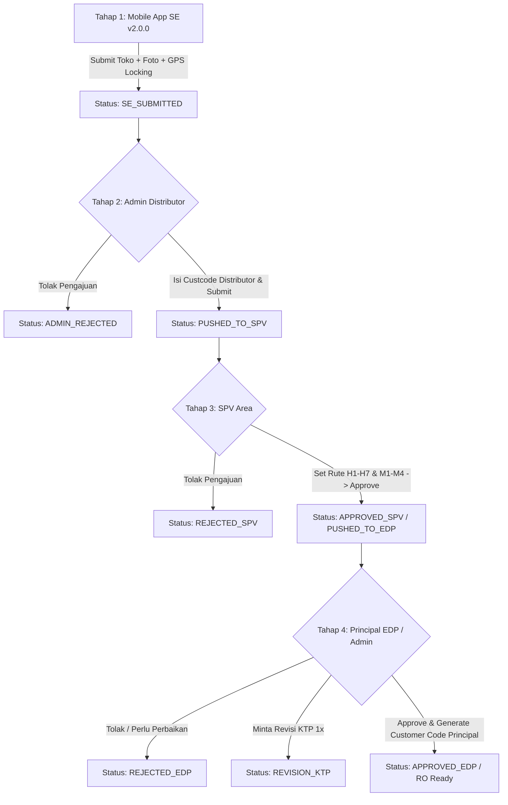

# 📘 Dokumentasi Komprehensif Arsitektur & Alur Sistem Informasi NOO+ (New Open Outlet) v2.0.0

Dokumen ini merupakan referensi resmi (*living memory*) komprehensif mengenai arsitektur, desain sistem, alur operasional *end-to-end*, integrasi API Mobile NOO v2.0.0, tata kelola otorisasi, generator kode pelanggan, standarisasi sinkronisasi filter-pagination-sort, struktur basis data, serta prosedur deployment **Sistem Informasi NOO+ (ASWFOODS & INAFOODS)**.

---

## 1. Fundamental & Tujuan Sistem

**Sistem Informasi NOO+** adalah platform enterprise terintegrasi untuk mendigitalkan, menstandarisasi, dan mengotomasi proses pendaftaran outlet/toko baru (*New Open Outlet*) secara nasional untuk principal **ASWFOODS** dan **INAFOODS**.

Sistem ini menggantikan seluruh proses lama (*legacy Google Apps Script & Google Spreadsheet*) menjadi sistem enterprise berbasis database PostgreSQL terpusat yang tangguh, aman, dan dapat diaudit secara *real-time*.

### Tujuan Utama:
1. **Validitas & Integritas Data Toko**: Menghilangkan duplikasi toko, memverifikasi foto fisik toko & KTP pemilik, serta memastikan akurasi titik koordinat GPS di lapangan dengan mekanisme *GPS Locking & Geo-Sampling* (toleransi meteran).
2. **Efisiensi Rantai Otorisasi (4 Tahap Workflow)**: Menghubungkan Sales Executive (lapangan via Android App v2.0.0), Admin Distributor (cabang), Supervisor Area (SPV), dan Tim Principal (EDP Regional/Admin Principal/Superadmin).
3. **Penerbitan Kode Pelanggan Principal Otomatis**: Otomasi generator nomor urut *Customer Code Principal* (`code_noo_principal`) berbasis prefix entitas, cabang, dan counter sequence atomik terkontrol (`C{PCODE}{PREFIX}{00001}`).
4. **Integrasi & Pemantauan Target RO**: Pelacakan target dan realisasi *Registered Outlet (RO)* per salesman dan cabang secara transparan.

---

## 2. Arsitektur & Teknologi (Tech Stack)

```
[ Android App NOO v2.0.0 (SE) ] ──(REST API JSON + Multipart)──┐
                                                                 ▼
[ Web Browser: Admin Distributor ] ──(Inertia.js SPA)──┼──► [ Nginx Reverse Proxy ]
[ Web Browser: SPV Area Portal ]   ──(Inertia.js SPA)──┤              │
[ Web Browser: Principal Portal ]  ──(Inertia.js SPA)──┘              ▼
                                                           [ Laravel 12.x Backend Engine ]
                                                           ├── Inertia.js + Vue 3 (Composition API)
                                                           ├── Eloquent ORM & Query Builder (ILIKE/LOWER)
                                                           ├── PhpSpreadsheet (Export/Import Engine)
                                                           ├── CustomerCodeGeneratorService (Atomic Seq)
                                                           ├── KtpRevisionService (Watermarking & Security)
                                                           └── Storage Engine (Public Symbolic Link)
                                                                       │
                                                                       ▼
                                                           [ PostgreSQL 16 Database ]
```

### Spesifikasi Komponen Teknologi:
- **Backend Framework**: PHP 8.2+ / Laravel 12.x
- **Frontend Architecture**: Vue.js 3 (Composition API / `<script setup>`), Inertia.js v1/v2, Tailwind CSS
- **Database Engine**: PostgreSQL 16 (dengan indeks pada `request_id`, `branch_id`, `status`, `salesman_code`, `created_at`)
- **Containerization**: Docker & Docker Compose (`docker compose exec app ...`)
- **File Storage**: Local Symbolic Storage (`storage/app/public/noo_photos/` disajikan via `/storage/`)
- **Document Engine**: `PhpSpreadsheet` (Export Approved/Rejected `.xlsx` & Upload Target RO)

---

## 3. Integrasi Inputan NOO dari Aplikasi Mobile Android NOO v2.0.0

Aplikasi Android NOO v2.0.0 digunakan oleh Sales Executive (SE) di lapangan untuk menginputkan data toko baru secara akurat dan anti-fraud.

### Endpoint API Mobile:
1. **Pemeriksaan Versi & Metadata**: `GET /api/mobile/version-check`, `GET /api/mobile/master-data` (Region, Cabang, Tipe Outlet).
2. **Validasi PIN Cabang**: `POST /api/mobile/auth-branch` (Memvalidasi PIN 6 digit cabang sebelum submisi).
3. **Submit Metadata Toko**: `POST /api/mobile/submit-meta` (Payload JSON lengkap).
4. **Upload Foto Toko & KTP**: `POST /api/mobile/upload-photo` (Multipart upload: `photo_depan`, `photo_dalam`, `photo_ktp`).

### Payload Standar Android NOO v2.0.0:
```json
{
  "request_id": "9b1deb4d-3b7d-4bad-9bdd-2b0d7b3dcb6d",
  "principal": "ASWFOODS",
  "principal_code": "A",
  "region_code": "ASWSUM3",
  "branch_id": "DAPLG002",
  "branch_name": "CV. SUMATERA PALEMBANG",
  "salesman_code": "SEAPLB04",
  "salesman_name": "YUSPITA MIDA",
  "nama_noo": "TOKO ELI",
  "nama_pemilik_outlet": "ELI",
  "no_hp_noo": "081234567890",
  "alamat_noo": "Jl. Kimarogan, Kemas Rindo, Kertapati",
  "kel_noo": "Kemas Rindo",
  "kec_noo": "Kertapati",
  "kab_kota_noo": "Kota Palembang",
  "provinsi_noo": "Sumatera Selatan",
  "type_outlet_code": "GT04",
  "type_outlet_desc": "Retail Traditional",
  "la": -2.991234,
  "lg": 104.756789,
  "accuracy_m": 8.5,
  "samples_count": 5,
  "locked_la": -2.991234,
  "locked_lg": 104.756789,
  "locked_accuracy_m": 8.5,
  "mock_flag_locked": false,
  "submit_distance_m": 2.1
}
```

---

## 4. Alur Operasional End-to-End (4 Tahapan Workflow)



### Rincian 4 Tahapan:

#### Tahap 1: Sales Executive (Mobile Android NOO v2.0.0)
- Mengisi identitas toko, kontak pemilik, klasifikasi outlet (`GT01`, `GT02`, `GT03`, `GT04`, `MT01`, dll.).
- Penguncian GPS (*Geo-Sampling*) dengan deteksi *Mock Location*.
- Pengambilan 2 foto wajib: **Tampak Depan** (dengan plang) dan **Tampak Dalam** (rak/display dagangan).
- **Status awal**: `SE_SUBMITTED`.

#### Tahap 2: Portal Admin Distributor (`/distributor-login` -> `/distributor/inbox`)
- Login cascading: Principal Area -> Region -> Entity -> Branch -> PIN Cabang.
- Memeriksa toko yang diajukan salesman cabangnya.
- Mengisi **Kode Customer Distributor** (`custcode_distributor`) sesuai master distributor.
- Tindakan:
  - **Submit ke SPV**: Mengirim ke SPV Area (`PUSHED_TO_SPV`).
  - **Tolak**: Menolak dengan catatan alasan (`ADMIN_REJECTED`).
  - **Edit Nama Toko**: Admin distributor memiliki hak koreksi penamaan outlet sebelum dipush ke SPV.

#### Tahap 3: Portal SPV Area (`/spv-login` -> `/spv/inbox`)
- Login dengan Salescode SPV & Password.
- Melihat daftar submisi pada cabang binaan (`myBranches`).
- **Penyusunan Rute Kunjungan (JKS)**: Menetapkan hari kunjungan (`H1` - `H7` / Senin - Minggu) dan minggu kunjungan (`M1` - `M4` / Minggu 1 - 4).
- **Aturan UI SPV Inbox**:
  - Modal detail hanya terbuka melalui tombol **"Kelola"** (menghindari click-trigger tidak sengaja pada baris).
  - Posisi data tabel sejajar rata tengah secara vertikal (*Vertical Align Middle*).
- Tindakan:
  - **Approve SPV**: Data lolos ke Principal (`APPROVED_SPV` / `PUSHED_TO_EDP`).
  - **Reject SPV**: Pengajuan ditolak dengan alasan penolakan (`REJECTED_SPV`).

#### Tahap 4: Portal Principal (`/principal/inbox`, `/principal/progress-tracking`, dll.)
- Aktor: EDP Regional, Admin Principal, Superadmin.
- **Verifikasi & Keputusan**:
  - **Approve EDP**: Menerbitkan kode `code_noo_principal` unik dan mengubah status menjadi `APPROVED_EDP`.
  - **Reject EDP**: Menolak submisi (`REJECTED_EDP`).
  - **Cancel Rejection**: Membatalkan penolakan (mengembalikan ke antrean review).
  - **Revisi KTP**: Fitur upload ulang foto KTP dengan watermark pengaman dan proteksi revisi maksimal 1x (`is_ktp_revised`).
  - **Toggle RO (Registered Outlet)**: Menandai toko sebagai pencapaian target RO.
  - **Cascading Reset (Progress Tracking)**:
    - *Reset Admin Input*: Mereset `custcode_distributor` dan mereset rute JKS SPV, mengembalikan status ke `SE_SUBMITTED`.
    - *Reset SPV Input*: Mereset rute JKS SPV, mengembalikan status ke `PUSHED_TO_SPV`.
    - *Reset Approval EDP*: Mengembalikan status `APPROVED_EDP` menjadi pending review tanpa menghapus riwayat kode sebelumnya.

---

## 5. Generator Kode Pelanggan Principal (`CustomerCodeGeneratorService`)

Formula penomoran pelanggan principal bersifat atomik dan unik:
$$\text{Customer Code} = \text{Prefix Utama} + \text{Principal Code} + \text{Prefix Cabang} + \text{Sequence Number (5 Digit)}$$

### Contoh Format:
- Prefix Utama: `C`
- Principal Code: `A` (ASWFOODS) / `I` (INAFOODS)
- Prefix Cabang: 3 karakter alfabet (contoh: Cabang `DAPLG002` -> Prefix `PLG`)
- Sequence: `00001`, `00002`, `00067`, dst.
- **Hasil**: `CAPLG00067`

### Logika Sequence:
- Tabel `counter_sequences` mengunci row via `DB::table('counter_sequences')->where(...)->lockForUpdate()`.
- Setiap kali toko baru disetujui (Approve EDP), sistem selalu mengambil sequence berikutnya (`last_seq + 1`) dari tabel `counter_sequences` dan memperbarui `last_seq` secara otomatis.

---

## 6. Standar Arsitektur Sinkronisasi Filter, Pagination, & Sorting

Untuk mencegah bug data kembali ke default 10 baris atau filter ter-reset saat berpindah halaman:

### 1. Komponen Global `<Pagination>`:
- Memancarkan event `@change-per-page="(val) => ..."` ke halaman induk.
- Menggunakan `getCurrentInstance()` untuk mendeteksi listener event secara andal sebelum menjalankan fallback URL.
- Mendukung opsi: `10`, `25`, `50`, `100`, dan `Tampilkan Semua` (`per_page = -1` / `100000`).

### 2. Standard Pattern di Halaman Vue (Inbox, Progress Tracking, Logs, Master):
```javascript
function getActiveQueryParams() {
  const queryParams = {};
  if (search.value) queryParams.search = search.value;
  if (selectedRegion.value) queryParams.region_code = selectedRegion.value;
  if (selectedBranch.value) queryParams.branch_id = selectedBranch.value;
  if (sortKey.value) queryParams.sort_key = sortKey.value;
  if (sortDir.value) queryParams.sort_dir = sortDir.value;

  const perPageVal = props.filters?.per_page !== undefined
    ? props.filters.per_page
    : (props.submissions?.per_page >= 100000 ? -1 : props.submissions?.per_page);
  if (perPageVal !== undefined && perPageVal !== null && perPageVal !== '') {
    queryParams.per_page = perPageVal;
  }
  return queryParams;
}

function applyFilters(overrides = {}) {
  const queryParams = getActiveQueryParams();
  Object.assign(queryParams, overrides);
  if (!overrides.page) queryParams.page = 1;

  router.get(route('route_name'), queryParams, {
    preserveState: true,
    preserveScroll: true,
    replace: true,
  });
}
```

### 3. Standard Backend Controller (Laravel):
```php
$perPage = (int) $request->input('per_page', 10);
if ($perPage <= 0) {
    $perPage = 100000;
}

// Sorting Case-Insensitive & Timestamp Coalesce
if (in_array($column, ['nama_noo', 'salesman_name', 'branch_name'])) {
    $query->orderByRaw("LOWER({$column}) {$sortDir}");
} elseif ($column === 'created_at' || $column === 'submitted_at') {
    $query->orderByRaw("COALESCE(submitted_at, created_at, updated_at) {$sortDir}");
}

$submissions = $query->paginate($perPage)->withQueryString();

$activeFilters = $request->only(['search', 'region_code', 'branch_id', 'sort_key', 'sort_dir', 'per_page']);
if ($request->has('per_page')) {
    $rawPerPage = (int) $request->input('per_page');
    $activeFilters['per_page'] = ($rawPerPage <= 0 || $rawPerPage >= 1000) ? -1 : $rawPerPage;
}
```

---

## 7. Matriks Hak Akses & Tata Kelola Otorisasi (Permissions Matrix)

Dikelola secara dinamis oleh Superadmin melalui menu `Manajemen Akun` (`AccountManagement.vue`):

| Fitur / Modul Portal | Admin Distributor | SPV Area | EDP Region | Admin Principal | Superadmin |
| :--- | :---: | :---: | :---: | :---: | :---: |
| **Mobile Android Submission** | ❌ | ❌ | ❌ | ❌ | ✅ (Testing) |
| **Input Custcode Distributor** | ✅ | ❌ | ❌ | ❌ | ✅ |
| **Penyusunan Rute JKS (H1-H7, M1-M4)** | ❌ | ✅ | ❌ | ❌ | ✅ |
| **Verifikasi Final & Terbitkan Kode** | ❌ | ❌ | ✅ | ✅ | ✅ |
| **Revisi KTP Pemilik (1x Watermark)** | ❌ | ❌ | ✅ | ✅ | ✅ |
| **Unlock / Reset Kunci Revisi KTP** | ❌ | ❌ | ❌ | ❌ | ✅ |
| **Reset Approval EDP / Rejection** | ❌ | ❌ | ❌ | ✅ | ✅ |
| **Monitoring RO (Target vs Realisasi)** | ❌ | ❌ | View Only | View Only | Full Control |
| **Progress Tracking & Reset Inputan** | ❌ | ❌ | View Only | Reset Admin/SPV | Full Control |
| **Master Region, Entity, Branch** | ❌ | ❌ | View Only | Kelola | Full Access |
| **Counter Sequence Setting** | ❌ | ❌ | ❌ | Setting | Full Access |
| **User Management & Role Matrix** | ❌ | ❌ | ❌ | ❌ | ✅ |
| **Audit Logs System** | ❌ | ❌ | ❌ | View Only | Full Access |

---

## 8. Struktur Basis Data Utama (PostgreSQL 16)

1. **`noo_submissions`**: Tabel induk pengajuan toko (UUID `request_id`, metadata outlet, koordinat GPS, URL 3 foto, status approval, JKS rute, kode distributor & principal).
2. **`users`**: Tabel otentikasi portal principal (`SUPERADMIN`, `ADMIN_PRINCIPAL`, `EDP_REGION`).
3. **`master_branches`**: Data cabang distributor beserta `pin_branch` untuk login SE mobile dan Admin Distributor.
4. **`master_regions` & `master_entities`**: Hierarki regionalisasi dan legalitas entitas principal (ASW/INA).
5. **`master_salesmen`**: Data sales executive lapangan.
6. **`master_spvs`**: Data akun SPV area beserta mapping cabang binaan.
7. **`master_outlet_types`**: Master tipe toko (`GT01`, `GT02`, `GT03`, `GT04`, `MT01`, dll.).
8. **`counter_sequences`**: Sequence generator counter customer code per cabang.
9. **`target_ros`**: Target bulanan Registered Outlet per salesman.
10. **`activity_logs`**: Audit trail aktivitas sistem (login, approve, reject, edit, delete).

---

## 9. Prosedur Deployment & Pemeliharaan Server

### 1. Terminal Lokal (Pengembangan / CMD Windows):
```cmd
cd /d d:\AndroidStudioProjects\noo-server

# 1. Build asset frontend (opsional lokal)
npm run build

# 2. Push perubahan ke GitHub
git add .
git commit -m "feat/fix: deskripsi perubahan"
git push origin main
```

### 2. Terminal Server Production (Termius / SSH Server 172.22.1.232):
```bash
cd /var/www/noo-server

# 1. Bersihkan file build lokal server jika ada conflict
git reset --hard HEAD
git clean -fd public/build

# 2. Tarik update terbaru dari GitHub
git pull origin main

# 3. Compile asset frontend Vite
npm run build

# 4. Clear cache aplikasi di dalam container Docker
docker compose exec app php artisan optimize:clear
```

---
*Dokumen ini merupakan panduan arsitektur resmi sistem informasi NOO+ ASWFOODS & INAFOODS.*
